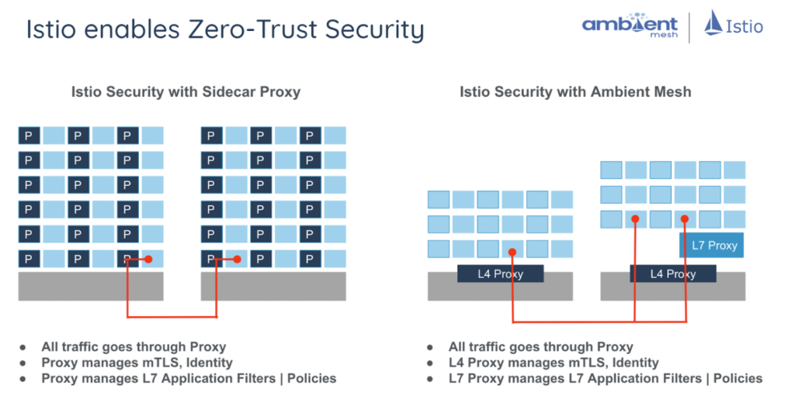
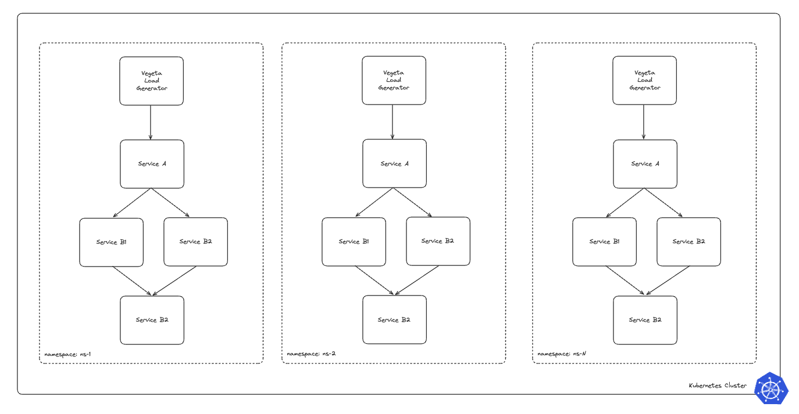
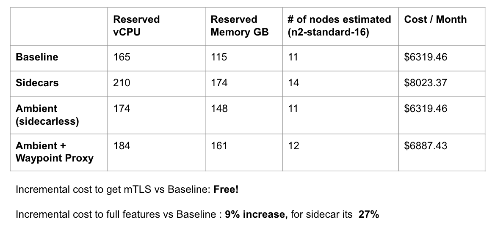
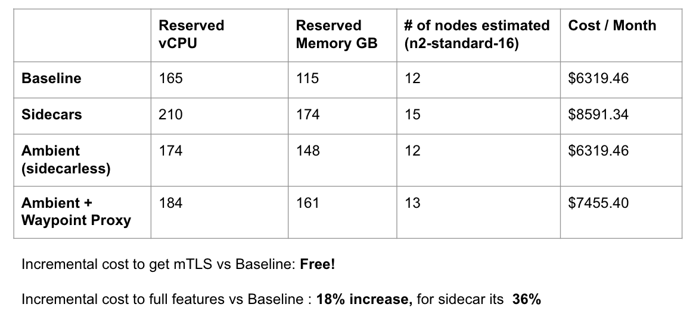
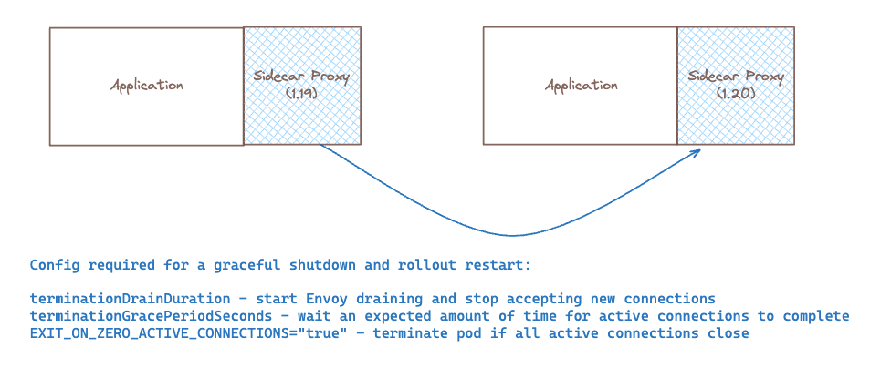

# Ambient Mesh - Doing More for Less!

With the introduction of Istio Ambient mesh, platform teams can more efficiently adopt service mesh features without introducing a significant resource overhead to their end consumers.

Here at Solo.io a common story that we hear among our customer-base and prospects that goes like this:
"The Security team has mandated a zero-trust posture across the entire organization, and as a result of this requirement I am looking to adopt a service mesh. However, in doing some research we have discovered that leveraging a sidecar based approach will incur some additional cost in resource reservations per app (by default in Istio 100m CPU and 128Mi MEM per sidecar), and operational overhead in managing the lifecycle of a sidecar deployment"

For teams with tight budgets, complying with this mandate presents significant opportunity costs. Trade-offs such as deciding between hiring additional staff or investing in other areas of the business versus bearing the increased cost of resources for the application becomes a critical consideration.

In conversations with those further along in their service mesh journey, it's often highlighted that the sidecar pattern offers an array of L7 capabilities, including:
- Advanced traffic management and routing control
- Native support for mutual Transport Layer Security (mTLS) in the ingress solution
- Fine-grained security policies at the application layer
- Efficient handling of circuit breaking and fault tolerance mechanisms
- Facilitated implementation of service discovery and dynamic service routing
- Simplified deployment of A/B testing and canary release strategies

But what if the user doesn't need these capabilities immediate near-term? Despite their potential benefits to the organization, the overhead costs of implementing and maintaining these additional value-add features also come at an expense and require a level of organizational maturity. Moreover, the costs are incurred regardless of their utilization, potentially pressuring the team to prioritize these features even if they're merely nice-to-haves.

# Ambient Mesh
[Ambient mesh](https://www.solo.io/blog/istio-ambient-mesh-evolution-service-mesh/) was launched on September 7th, 2022, introducing a new Istio data plane mode without sidecars that’s designed for simplified operations, broader application compatibility, and reduced infrastructure cost. Ambient splits Istio’s functionality into two distinct layers: the zero trust secure overlay layer, and optional Layer 7 processing layer. Compared with sidecars, this innovative layered approach allows users to easily adopt Istio incrementally, from no mesh, to the secure overlay, to full L7 processing as needed. This gives service mesh users two outstanding options from the same dedicated community: Istio with a sidecar model approach, or sidecarless Ambient mesh.




Now, returning to our original problem statement, in order to comply with the zero-trust mandate from Security, we no longer need to adopt a sidecar per application. Instead, we can leverage Ambient mode's `ztunnel` per-node architecture, which separates the responsibilities of zero-trust networking and Layer 7 policy handling. The resource costs associated with these components are as follows:

Istio Component Resource Requirements (all configurable for smaller deployments):
- ztunnel - `500m` CPU and `2048Mi` memory per node
- istio-cni - `100m` and `100Mi` memory per node
- istiod - `500m` and `2Gi` memory per replica

Ambient mode enables us to meet the mTLS requirement with a model that is less coupled to the resource costs of individual applications and instead scales with the cost of platform itself (more nodes, more `ztunnels`). With this approach, Application Owners no longer need to concern themselves with the presence of a sidecar in their workload, the lifecycle of that sidecar, and even the cost of the sidecar resource. Users of the sidecarless service mesh can assume that if the application is deployed on the cluster, it is inherently secure by default. Developers can then focus on developing and deploying their applications, increasing operational efficiency and providing a more seamless and frictionless developer productivity experience.

# Let's look at some numbers

Lets take the following application for our large scale application experiment:

Application Details:
- 50 namespace isolated applications
- 3-tier application structure
    - 4 deployments per namespace, 1 replicas per deployment 
    - A > B1,B2 > C
    - CPU requests: 700m // CPU limits: 700m (guaranteed QoS)
    - MEM requests: 500Mi // MEM limits: 500Mi (guaranteed QoS)

Load Generator Details:
- Load generator per namespace targeting tier 1 application level
  - deployed to separate loadgen node pool
  - using n2-standard-8 spot instances in autoscaling mode 1-6 nodes
  - RPS tuned with 25 connections
  - CPU requests: 500m // CPU limits: 500m (guaranteed QoS)
  - MEM requests: 300Mi // MEM limits: 300Mi (guaranteed QoS)

Baseline Resource Requirements:
When calculating the baseline resource requirements without service mesh enabled:
- Total application baseline requirements are 140 CPU cores and 100 GB memory
- Total load generator baseline requirements are 25 CPU cores and 15 GB memory

Total expected baseline requirements: 165 CPU Cores and 115 GB memory

A high level architecture looks like this:



## In an ideal bin packing scenario


In an ideal world, where everything is perfectly scheduled like an expert tetris player, our capacity planning exercise would be a rather simple calculation



Source: using the [Google Cloud Pricing Calculator](https://cloud.google.com/products/calculator?hl=en)

## Reality is not an ideal bin packing scenario


In reality, Kubernetes scheduling is not perfect, and inefficiencies in bin packing workloads will result in additional resources consumed (nodes created) so that all workloads can be scheduled. The following table shows the actual results of deploying the example application described in our test environment:



The results mirror the goals of the Ambient project in both simplifying operations of the service mesh (no sidecars!) as well as reducing infrastructure costs (no additional cost to fulfill mTLS requirement). We also see an added benefit where if we decide to incrementally adopt the full L7 feature set by adopting waypoint proxies, the cost would be +18% from baseline using `ztunnel` + waypoint proxies vs. the traditional sidecar approach at +36%

# Simplifying Operations



One of the most common challenges that we see with service mesh adoption is the increase in operational overhead to manage the lifecycle of the sidecar for the Platform or Application owners. This challenge becomes particularly pronounced during proxy upgrades, such as transitioning from version 1.19 to 1.20 as depicted above

With a sidecar approach, users need to ensure that Kubernetes + proxy is configured to do the following:
- Initiate the draining process and stop accepting new connections
- Ensure that all connections are drained before termination
- Configure the Kubernetes scheduler to avoid premature pod termination
- Terminate early if all active connections close

All of these considerations go away when adopting a sidecarless service mesh architecture! This new approach significantly reduces this operational burden, providing more time for developers to focus on developing application features rather than infrastructure related concerns of managing proxies at scale.

# What about Performance?

In the spirit of this blog post about doing more for less, we have already covered two initial goals of Ambient mesh in reducing infrastructure cost as well as simplifying operations, but what about performance?

Taking the example app above, we ran the following experiment to validate that Ambient mesh can perform at-par or better than the traditional sidecar based approach. For this test, we evaluated the same application deployed on a cluster with LinkerD against a cluster with Istio Ambient Mesh.

First we set some baseline performance requirements for our 3-tier application workload that is deployed across 50 namespaces. 

Our application latency expectations:
- Average latency < 40ms
- Max latency < 200ms
- Expected CPU utilization tuned to around 20-40% (visualized in GKE Observability)

We configured a Vegeta loadgenerator client per-namespace with a guaranteed QoS by setting resource requests/limits to `500m` CPU and `300Mi` MEM for this experiment:

Our Loadgenerator Client Configuration:
- Load generator per namespace targeting tier 1 application level
  - deployed to separate loadgen node pool
  - using n2-standard-8 spot instances in autoscaling mode 1-6 nodes
  - Tune RPS with 25 connections starting at 200RPS
  - CPU requests: 500m // CPU limits: 500m (guaranteed QoS)
  - MEM requests: 300Mi // MEM limits: 300Mi (guaranteed QoS)

## LinkerD Run 1

Starting with LinkerD, we noticed that by default there are no proxy resource requests/limits defined, unlike Istio which sets the default sidecar proxy resource requests to `100m` CPU and `128Mi` MEM.

Running our test, we produced results similar to the following:
```bash
% kubectl logs -l app=vegeta -f -c vegeta -n ns-3
Requests      [total, rate, throughput]         120000, 200.00, 194.77
Duration      [total, attack, wait]             10m0s, 10m0s, 5.057ms
Latencies     [min, mean, 50, 90, 95, 99, max]  3.748ms, 59.051ms, 4.712ms, 5.917ms, 22.833ms, 2.142s, 2.995s
Bytes In      [total, mean]                     324868342, 2707.24
Bytes Out     [total, mean]                     0, 0.00
Success       [ratio]                           97.39%
Status Codes  [code:count]                      200:116864  500:3136  
```

What we observed was that without proper resource requests defined the mean, p50, p90, and p95 latency percentiles were meeting our expectations, but p99 and max latencies were not. Furthermore, at some point in the test we observed several `500` errors, signaling that we might have been overloading the proxy.

## LinkerD Run 2

To reduce the noise seen at the p99 and max latency for the initial run, we decided to set LinkerD proxy resources to match the defaults set by Istio discussed above. 

A re-run of the test produced results similar to the following:
```bash
% kubectl logs -l app=vegeta -f -c vegeta -n ns-14
Requests      [total, rate, throughput]         120000, 200.00, 200.00
Duration      [total, attack, wait]             10m0s, 10m0s, 4.732ms
Latencies     [min, mean, 50, 90, 95, 99, max]  3.957ms, 4.663ms, 4.589ms, 5.026ms, 5.238ms, 5.863ms, 25.743ms
Bytes In      [total, mean]                     328128549, 2734.40
Bytes Out     [total, mean]                     0, 0.00
Success       [ratio]                           100.00%
Status Codes  [code:count]                      200:120000  

% kubectl logs -l app=vegeta -f -c vegeta -n ns-10
Requests      [total, rate, throughput]         120000, 200.00, 200.00
Duration      [total, attack, wait]             10m0s, 10m0s, 5.431ms
Latencies     [min, mean, 50, 90, 95, 99, max]  4.084ms, 127.155ms, 5.349ms, 391.051ms, 606.356ms, 752.473ms, 817.085ms
Bytes In      [total, mean]                     328128724, 2734.41
Bytes Out     [total, mean]                     0, 0.00
Success       [ratio]                           100.00%
Status Codes  [code:count]                      200:120000 
```

Here we see that specifying the resource requests resulted in improved performance and eliminated the `500` errors, but we were still observing inconsistent latency numbers in our results. Above is an output from two namespaces, the top with an outcome that is in line with what we expect, and the bottom with some inconsistency. Across all 50 namespaces we observed this inconsistency in 13 namespaces in our test run.

## LinkerD Run 3

Finally, we tested setting LinkerD proxy resources to double the default resources set by Istio at `200m` CPU and `256Mi` MEM per proxy and observed results that were in line with our performance criteria, with all 50 namespaces within the latency requirements expected for this experiment

A re-run of the test produced results similar to the following:
```bash
% kubectl logs -l app=vegeta -c vegeta -n ns-1
Status Codes  [code:count]                      200:120000  
Error Set:
Requests      [total, rate, throughput]         120000, 200.00, 200.00
Duration      [total, attack, wait]             10m0s, 10m0s, 4.638ms
Latencies     [min, mean, 50, 90, 95, 99, max]  4.073ms, 4.844ms, 4.726ms, 5.277ms, 5.549ms, 6.004ms, 55.691ms
Bytes In      [total, mean]                     327768040, 2731.40
Bytes Out     [total, mean]                     0, 0.00
Success       [ratio]                           100.00%
Status Codes  [code:count]                      200:120000 

% kubectl logs -l app=vegeta -c vegeta -n ns-10 
Status Codes  [code:count]                      200:120000  
Error Set:
Requests      [total, rate, throughput]         120000, 200.00, 200.00
Duration      [total, attack, wait]             10m0s, 10m0s, 4.704ms
Latencies     [min, mean, 50, 90, 95, 99, max]  3.944ms, 4.71ms, 4.61ms, 5.033ms, 5.234ms, 5.699ms, 56.531ms
Bytes In      [total, mean]                     328369889, 2736.42
Bytes Out     [total, mean]                     0, 0.00
Success       [ratio]                           100.00%
Status Codes  [code:count]                      200:120000

% kubectl logs -l app=vegeta -c vegeta -n ns-20
Status Codes  [code:count]                      200:120000  
Error Set:
Requests      [total, rate, throughput]         120000, 200.00, 200.00
Duration      [total, attack, wait]             10m0s, 10m0s, 4.317ms
Latencies     [min, mean, 50, 90, 95, 99, max]  3.892ms, 4.457ms, 4.407ms, 4.718ms, 4.871ms, 5.243ms, 39.458ms
Bytes In      [total, mean]                     328484994, 2737.37
Bytes Out     [total, mean]                     0, 0.00
Success       [ratio]                           100.00%
Status Codes  [code:count]                      200:120000

% kubectl logs -l app=vegeta -c vegeta -n ns-30
Status Codes  [code:count]                      200:120000  
Error Set:
Requests      [total, rate, throughput]         120000, 200.00, 200.00
Duration      [total, attack, wait]             10m0s, 10m0s, 4.748ms
Latencies     [min, mean, 50, 90, 95, 99, max]  4.112ms, 4.888ms, 4.761ms, 5.401ms, 5.689ms, 6.212ms, 41.067ms
Bytes In      [total, mean]                     328609303, 2738.41
Bytes Out     [total, mean]                     0, 0.00
Success       [ratio]                           100.00%
Status Codes  [code:count]                      200:120000 

% kubectl logs -l app=vegeta -c vegeta -n ns-40
Status Codes  [code:count]                      200:120000  
Error Set:
Requests      [total, rate, throughput]         120000, 200.00, 200.00
Duration      [total, attack, wait]             10m0s, 10m0s, 3.534ms
Latencies     [min, mean, 50, 90, 95, 99, max]  3.256ms, 4.03ms, 3.975ms, 4.346ms, 4.478ms, 4.891ms, 42.394ms
Bytes In      [total, mean]                     328727224, 2739.39
Bytes Out     [total, mean]                     0, 0.00
Success       [ratio]                           100.00%
Status Codes  [code:count]                      200:120000 

% kubectl logs -l app=vegeta -c vegeta -n ns-50
Status Codes  [code:count]                      200:120000  
Error Set:
Requests      [total, rate, throughput]         120000, 200.00, 200.00
Duration      [total, attack, wait]             10m0s, 10m0s, 4.406ms
Latencies     [min, mean, 50, 90, 95, 99, max]  3.689ms, 4.549ms, 4.489ms, 4.938ms, 5.164ms, 5.835ms, 11.804ms
Bytes In      [total, mean]                     328491167, 2737.43
Bytes Out     [total, mean]                     0, 0.00
Success       [ratio]                           100.00%
Status Codes  [code:count]                      200:120000  
```

Below we can see the 30 minute history cluster CPU dashboard for this test run as shown in the GKE console


# Ambient Run 1

With Ambient, we don't have to worry about the sidecar proxy, so the test is rather simple:
- Deploy the applications
- Run the load generator clients

Running the same test that we did previously, we produced results similar to the following:
```base
% kubectl logs -l app=vegeta -f -n ns-1
Status Codes  [code:count]                      200:180000  
Error Set:
Requests      [total, rate, throughput]         180000, 300.00, 300.00
Duration      [total, attack, wait]             10m0s, 10m0s, 2.869ms
Latencies     [min, mean, 50, 90, 95, 99, max]  2.27ms, 3.005ms, 2.966ms, 3.307ms, 3.444ms, 3.849ms, 55.613ms
Bytes In      [total, mean]                     491654822, 2731.42
Bytes Out     [total, mean]                     0, 0.00
Success       [ratio]                           100.00%
Status Codes  [code:count]                      200:180000

% kubectl logs -l app=vegeta -n ns-10
Status Codes  [code:count]                      200:180000  
Error Set:
Requests      [total, rate, throughput]         180001, 300.00, 300.00
Duration      [total, attack, wait]             10m0s, 10m0s, 2.699ms
Latencies     [min, mean, 50, 90, 95, 99, max]  2.242ms, 2.836ms, 2.8ms, 3.097ms, 3.22ms, 3.573ms, 67.36ms
Bytes In      [total, mean]                     493094559, 2739.40
Bytes Out     [total, mean]                     0, 0.00
Success       [ratio]                           100.00%
Status Codes  [code:count]                      200:180001 

% kubectl logs -l app=vegeta -n ns-20
Status Codes  [code:count]                      200:180000  
Error Set:
Requests      [total, rate, throughput]         180000, 300.00, 300.00
Duration      [total, attack, wait]             10m0s, 10m0s, 2.614ms
Latencies     [min, mean, 50, 90, 95, 99, max]  2.1ms, 2.644ms, 2.618ms, 2.855ms, 2.951ms, 3.222ms, 78.651ms
Bytes In      [total, mean]                     492373717, 2735.41
Bytes Out     [total, mean]                     0, 0.00
Success       [ratio]                           100.00%
Status Codes  [code:count]                      200:180000 

% kubectl logs -l app=vegeta -n ns-30
Status Codes  [code:count]                      200:180000  
Error Set:
Requests      [total, rate, throughput]         180000, 300.00, 300.00
Duration      [total, attack, wait]             10m0s, 10m0s, 2.06ms
Latencies     [min, mean, 50, 90, 95, 99, max]  1.789ms, 3.042ms, 2.92ms, 3.862ms, 4.271ms, 5.832ms, 38.867ms
Bytes In      [total, mean]                     492197230, 2734.43
Bytes Out     [total, mean]                     0, 0.00
Success       [ratio]                           100.00%
Status Codes  [code:count]                      200:180000 

% kubectl logs -l app=vegeta -n ns-40
Status Codes  [code:count]                      200:180000  
Error Set:
Requests      [total, rate, throughput]         180000, 300.00, 300.00
Duration      [total, attack, wait]             10m0s, 10m0s, 2.73ms
Latencies     [min, mean, 50, 90, 95, 99, max]  2.085ms, 2.631ms, 2.599ms, 2.875ms, 2.987ms, 3.337ms, 55.915ms
Bytes In      [total, mean]                     493092022, 2739.40
Bytes Out     [total, mean]                     0, 0.00
Success       [ratio]                           100.00%
Status Codes  [code:count]                      200:180000 

% kubectl logs -l app=vegeta -n ns-50
Status Codes  [code:count]                      200:180000  
Error Set:
Requests      [total, rate, throughput]         180000, 300.00, 300.00
Duration      [total, attack, wait]             10m0s, 10m0s, 2.621ms
Latencies     [min, mean, 50, 90, 95, 99, max]  2.21ms, 2.855ms, 2.83ms, 3.082ms, 3.185ms, 3.472ms, 54.359ms
Bytes In      [total, mean]                     492373033, 2735.41
Bytes Out     [total, mean]                     0, 0.00
Success       [ratio]                           100.00%
Status Codes  [code:count]                      200:180000 
```

Without any tuning of the default Ambient mesh settings, we achieved our application latency performance requirements on the first run test run!

Below we can see the 30 minute history cluster CPU dashboard for this test run as shown in the GKE console


# Conclusion

In this blog we explored three main value propositions for Istio Ambient Mesh
- Simplify operations of the service mesh
- Reduce infrastructure costs
- Improved resource utilization and application performance

In our hypothetical scenario detailed in this experiment, the adoption of Ambient mesh fulfills the mTLS mandate that was implemented by the Security team without imposing any additional cost to the Application team. Furthermore, adopting a sidecarless architecture additionally reduces the operational overhead to truly be "ambient" for the development persona. As a result, the organization as a whole benefits from the improved resource utilization while maintaining or even improving application performance. It is clear here that we are benefitting while doing more for less!

As Solo.io is a co-founder of the Istio ambient sidecar-less architecture and leads the development upstream in the Istio community, we are uniquely positioned to help our customers adopt this architecture for production security and compliance requirements. [Please reach out to us to talk with an expert.](https://www.solo.io/company/contact/)


