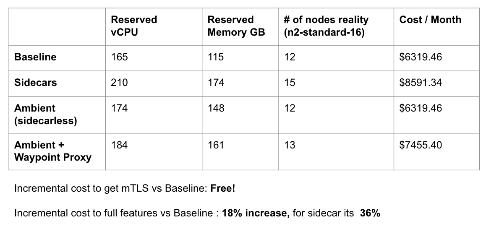
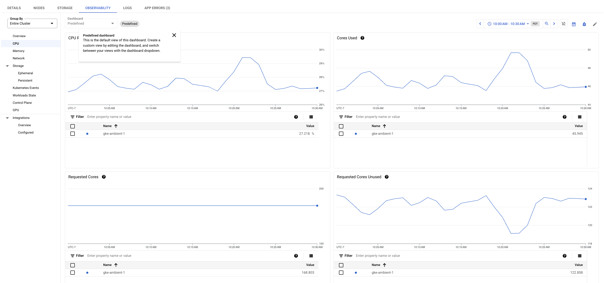
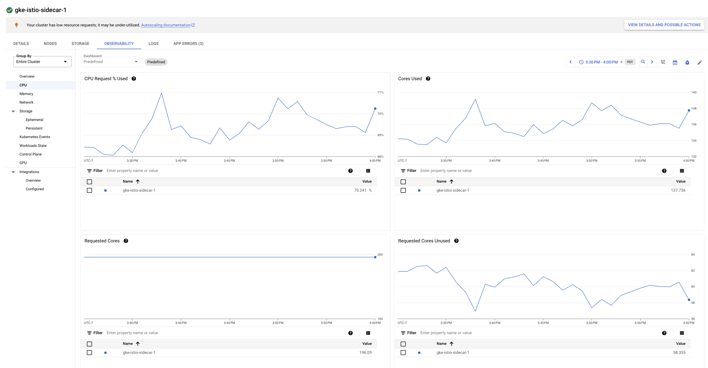

# Istio Ambient Mode - Doing More for Less!

With the introduction of Istio Ambient mesh, platform teams can more efficiently adopt service mesh features without introducing a significant resource overhead to their end consumers.

Here at Solo.io a common story that we hear among our customer-base and prospects that goes like this:
"The Security team has mandated a zero-trust posture across the entire organization, and as a result of this requirement I am looking to adopt a service mesh. However, in doing some research we have discovered that leveraging a sidecar based approach will incur some additional cost in resource reservations per app (by default in Istio 100m CPU and 128Mi MEM per sidecar), and operational overhead in managing the lifecycle of a sidecar deployment"

For teams with tight budgets, complying with this mandate presents significant opportunity costs. Trade-offs such as deciding between hiring additional staff or investing in other areas of the business versus bearing the increased cost of resources for the application becomes a critical consideration.

In conversations with those further along in their service mesh journey, it's often highlighted that the sidecar pattern offers an array of L7 capabilities, including:
- Advanced traffic management and routing control
- Native support for mutual Transport Layer Security (mTLS) in the ingress solution
- Fine-grained security policies at the application layer
- Efficient handling of circuit breaking and fault tolerance mechanisms
- Facilitated implementation of service discovery and dynamic service routing
- Simplified deployment of A/B testing and canary release strategies

But what if the user doesn't need these capabilities immediate near-term? Despite their potential benefits to the organization, the overhead costs of implementing and maintaining these additional value-add features also come at an expense and require a level of organizational maturity. Moreover, the costs are incurred regardless of their utilization, potentially pressuring the team to prioritize these features even if they're merely nice-to-haves.

# Ambient Mode
[Ambient mesh](https://www.solo.io/blog/istio-ambient-mesh-evolution-service-mesh/) was launched on September 7th, 2022, introducing a new Istio data plane mode without sidecars that’s designed for simplified operations, broader application compatibility, and reduced infrastructure cost. Ambient splits Istio’s functionality into two distinct layers: the zero trust secure overlay layer, and optional Layer 7 processing layer. Compared with sidecars, the layered approach allows users to adopt Istio incrementally from no mesh, to the secure overlay, to full L7 processing as needed. This gives service mesh users two outstanding options from the same dedicated community: Istio with a sidecar model approach, or sidecarless Ambient mesh.


Now, returning to our original problem statement, in order to comply with the zero-trust mandate from Security, we no longer need to adopt a sidecar per application. Instead, we can leverage Ambient mode's `ztunnel` per-node architecture, which separates the responsibilities of zero-trust networking and Layer 7 policy handling. The resource costs associated with these components are as follows:

Istio Component Resource Requirements (all configurable for smaller deployments):
- ztunnel - `500m` CPU and `2048Mi` memory per node
- istio-cni - `100m` and `100Mi` memory per node
- istiod - `500m` and `2Gi` memory per replica

Ambient mode enables us to meet the mTLS requirement with a model that is less coupled to the resource costs of individual applications and instead scales with the cost of platform itself (more nodes, more `ztunnels`). With this approach, Application Owners no longer need to concern themselves with the presence of a sidecar in their workload, the lifecycle of that sidecar, and even the cost of the sidecar resource. Users of the sidecarless service mesh can assume that if the application is deployed on the cluster, it is inherently secure by default. Developers can then focus on developing and deploying their applications, increasing operational efficiency and providing a more seamless and frictionless developer productivity experience.

# Let's look at some numbers

Lets take the following application for our large scale application experiment:

Application Details:
- 50 namespace isolated applications
- 3-tier application structure
    - 4 deployments per namespace, 1 replicas per deployment 
    - A > B1,B2 > C
    - CPU requests: 700m // CPU limits: 700m (guaranteed QoS)
    - MEM requests: 500Mi // MEM limits: 500Mi (guaranteed QoS)

Load Generator Details:
- Load generator per namespace targeting tier 1 application level
  - deployed to separate loadgen node pool to ensure unbiased performance measurements by preventing resource contention and interference 
  - using n2-standard-8 spot instances in autoscaling mode 1-6 nodes
  - Each loadgen client is configured at 450 RPS for a total of *22.5K RPS cluster-wide*
  - CPU requests: 500m // CPU limits: 500m (guaranteed QoS)
  - MEM requests: 300Mi // MEM limits: 300Mi (guaranteed QoS)

Baseline Resource Requirements:
When calculating the baseline resource requirements without service mesh enabled:
- Total application baseline requirements are 140 CPU cores and 100 GB memory
- Total load generator baseline requirements are 25 CPU cores and 15 GB memory

Total expected baseline requirements: 165 CPU Cores and 115 GB memory

A high level architecture looks like this:


## In an ideal bin packing scenario


In an ideal world, where everything is perfectly scheduled like an expert tetris player, our capacity planning exercise would be a rather simple calculation


Source: using the [Google Cloud Pricing Calculator](https://cloud.google.com/products/calculator?hl=en)

## Reality is not an ideal bin packing scenario


In reality, Kubernetes scheduling is not perfect, and inefficiencies in bin packing workloads will result in additional resources consumed (nodes created) so that all workloads can be scheduled. The following table shows the actual results of deploying the example application described in our test environment:



The results mirror the goals of the Ambient project in both simplifying operations of the service mesh (no sidecars!) as well as reducing infrastructure costs (no additional cost to fulfill mTLS requirement). We also see an added benefit where if we decide to incrementally adopt the full L7 feature set by adopting waypoint proxies, the cost would be +18% from baseline using `ztunnel` + waypoint proxies vs. the traditional sidecar approach at +36%

# Simplifying Operations


One of the most common challenges that we see with service mesh adoption is the increase in operational overhead to manage the lifecycle of the sidecar for the Platform or Application owners. This challenge becomes particularly pronounced during proxy upgrades, such as transitioning from version 1.19 to 1.20 as depicted above

With a sidecar approach, users need to ensure that Kubernetes + proxy is configured to do the following:
- Initiate the draining process and stop accepting new connections
- Ensure that all connections are drained before termination
- Configure the Kubernetes scheduler to avoid premature pod termination
- Terminate early if all active connections close

All of these considerations go away when adopting a sidecarless service mesh architecture! This new approach significantly reduces this operational burden, providing more time for developers to focus on developing application features rather than infrastructure related concerns of managing proxies at scale.

# What about Performance?

With the premise of this blog post focused on doing more for less, we have already covered two initial goals of Ambient mesh in reducing infrastructure cost as well as simplifying operations, but what about performance?

Taking the example app above, we ran the following experiment to validate that Ambient mesh can perform at-par or better than the traditional sidecar based approach. For this test, we evaluated the same application deployed on a cluster with LinkerD against a cluster with Istio Ambient Mode.

First we set some baseline performance requirements for our 3-tier application workload that is deployed across 50 namespaces. 

Our application latency expectations:
- Max P50 latency < 20ms
- Max P99 latency < 30ms
- Desired CPU utilization of the cluster around > 25% (visualized in GKE Observability)

We configured a Vegeta loadgenerator client per-namespace with a guaranteed QoS by setting resource requests/limits to `500m` CPU and `300Mi` MEM for this experiment:

Our Loadgenerator Client Configuration:
- Load generator per namespace targeting tier 1 application level
  - deployed to separate loadgen node pool to ensure unbiased performance measurements by preventing resource contention and interference
  - using n2-standard-8 spot instances in autoscaling mode
  - Each loadgen client is configured at 450 RPS for a total of *22.5K RPS cluster-wide*
  - CPU requests: 500m // CPU limits: 500m (guaranteed QoS)
  - MEM requests: 300Mi // MEM limits: 300Mi (guaranteed QoS)

## Baseline testing
Starting with our baseline application (no mesh) to understand the base performance characteristics

A run of the test produced results similar to the following:
```bash
Namespace: ns-1
Pod: vegeta-ns-1-7fdb65c5d4-6mg47
Requests      [total, rate, throughput]         270000, 450.00, 450.00
Duration      [total, attack, wait]             10m0s, 10m0s, 1.682ms
Latencies     [min, mean, 50, 90, 95, 99, max]  1.237ms, 1.612ms, 1.592ms, 1.757ms, 1.842ms, 2.099ms, 11.693ms
Bytes In      [total, mean]                     736131394, 2726.41
Bytes Out     [total, mean]                     0, 0.00
Success       [ratio]                           100.00%
Status Codes  [code:count]                      200:270000 

Namespace: ns-25
Pod: vegeta-ns-25-7c9b875bc4-xwt5f
Requests      [total, rate, throughput]         270000, 450.00, 450.00
Duration      [total, attack, wait]             10m0s, 10m0s, 1.419ms
Latencies     [min, mean, 50, 90, 95, 99, max]  1.269ms, 1.557ms, 1.533ms, 1.677ms, 1.754ms, 2.011ms, 65.268ms
Bytes In      [total, mean]                     737205508, 2730.39
Bytes Out     [total, mean]                     0, 0.00
Success       [ratio]                           100.00%
Status Codes  [code:count]                      200:270000  

Namespace: ns-50
Pod: vegeta-ns-50-78d5d67cfd-2jqmd
Requests      [total, rate, throughput]         270000, 450.00, 450.00
Duration      [total, attack, wait]             10m0s, 10m0s, 1.567ms
Latencies     [min, mean, 50, 90, 95, 99, max]  1.292ms, 1.618ms, 1.589ms, 1.778ms, 1.864ms, 2.151ms, 22.973ms
Bytes In      [total, mean]                     739102382, 2737.42
Bytes Out     [total, mean]                     0, 0.00
Success       [ratio]                           100.00%
Status Codes  [code:count]                      200:270000  
```

### Results across several 10 minute runs:
- P50 latency ~`1.5ms`
- P99 latency ~`2.1ms`

We can reasonably assume that the baseline performance at 450RPS for the sample application is typically between `1.5ms - 2.1ms`.Full results for the baseline tests can be seen in the `/experiment-data` directory

Below we can see the 30 minute history cluster CPU dashboard for this test run as shown in the GKE console



## LinkerD testing with v1.16.11

Starting with LinkerD, we noticed that by default there are no proxy resource requests/limits defined, unlike Istio which sets the default sidecar proxy resource requests to `100m` CPU and `128Mi` MEM.

While the results of our test were acceptable without any resource requests defined for the proxies (sub `4-8ms` p99 latency), it generally is not a recommended way of running a service mesh. In order to create an accurate comparison, we decided to test setting LinkerD proxy resources to match the default resources set by Istio at `100m` CPU and `128Mi` MEM per proxy with the helm values
```bash
--set proxy.cores=8
--set proxy.resources.cpu.request=100m
--set proxy.resources.memory.request=128Mi
```

A run of the test produced results similar to the following:
```bash
Namespace: ns-1
Pod: vegeta-ns-1-7fdb65c5d4-zw66v
Requests      [total, rate, throughput]         270001, 450.00, 450.00
Duration      [total, attack, wait]             10m0s, 10m0s, 4.655ms
Latencies     [min, mean, 50, 90, 95, 99, max]  3.532ms, 4.614ms, 4.55ms, 5.074ms, 5.279ms, 5.86ms, 24.758ms
Bytes In      [total, mean]                     737484998, 2731.42
Bytes Out     [total, mean]                     0, 0.00
Success       [ratio]                           100.00%
Status Codes  [code:count]                      200:270001  

Namespace: ns-25
Pod: vegeta-ns-25-7c9b875bc4-rb2vh
Requests      [total, rate, throughput]         270001, 450.00, 450.00
Duration      [total, attack, wait]             10m0s, 10m0s, 4.198ms
Latencies     [min, mean, 50, 90, 95, 99, max]  3.426ms, 4.491ms, 4.41ms, 4.98ms, 5.215ms, 5.872ms, 21.354ms
Bytes In      [total, mean]                     739379290, 2738.43
Bytes Out     [total, mean]                     0, 0.00
Success       [ratio]                           100.00%
Status Codes  [code:count]                      200:270001  

Namespace: ns-50
Pod: vegeta-ns-50-78d5d67cfd-46qkb
Requests      [total, rate, throughput]         270000, 450.00, 450.00
Duration      [total, attack, wait]             10m0s, 10m0s, 4.179ms
Latencies     [min, mean, 50, 90, 95, 99, max]  3.586ms, 4.267ms, 4.211ms, 4.586ms, 4.755ms, 5.295ms, 29.996ms
Bytes In      [total, mean]                     738561561, 2735.41
Bytes Out     [total, mean]                     0, 0.00
Success       [ratio]                           100.00%
Status Codes  [code:count]                      200:270000 
```

### Results across several 10 minute runs:
- lowest P50 latency `4.1ms`
- highest P99 latency `6.5ms`

From these results, we can derive that the addition of LinkerD sidecars to our test application adds around `2.6ms - 4.4ms` of latency to our application round-trip. Full results for the LinkerD tests can be seen in the `/experiment-data` directory

Below we can see the 30 minute history cluster CPU dashboard for this test run as shown in the GKE console


## Istio Sidecar testing with v1.21.0

Next we ran the same test using the traditional Istio sidecar mode, keeping the same default proxy reservation requests of `100m` CPU and `128Mi` MEM.

A run of the test produced results similar to the following:
```bash
Namespace: ns-1
Pod: vegeta-ns-1-7fdb65c5d4-484c5
Status Codes  [code:count]                      200:270000  
Error Set:
Requests      [total, rate, throughput]         270000, 450.00, 450.00
Duration      [total, attack, wait]             10m0s, 10m0s, 6.842ms
Latencies     [min, mean, 50, 90, 95, 99, max]  5.287ms, 7.031ms, 6.848ms, 7.974ms, 8.525ms, 10.049ms, 98.891ms
Bytes In      [total, mean]                     819315334, 3034.50
Bytes Out     [total, mean]                     0, 0.00
Success       [ratio]                           100.00%
Status Codes  [code:count]                      200:270000 

Namespace: ns-25
Pod: vegeta-ns-25-7c9b875bc4-8q9gz
Status Codes  [code:count]                      200:270000  
Error Set:
Requests      [total, rate, throughput]         270000, 450.00, 450.00
Duration      [total, attack, wait]             10m0s, 10m0s, 7.786ms
Latencies     [min, mean, 50, 90, 95, 99, max]  5.448ms, 7.837ms, 7.55ms, 9.383ms, 10.235ms, 12.179ms, 73.324ms
Bytes In      [total, mean]                     821216964, 3041.54
Bytes Out     [total, mean]                     0, 0.00
Success       [ratio]                           100.00%
Status Codes  [code:count]                      200:270000 

Namespace: ns-50
Pod: vegeta-ns-50-78d5d67cfd-6spmz
Status Codes  [code:count]                      200:270000  
Error Set:
Requests      [total, rate, throughput]         270000, 450.00, 450.00
Duration      [total, attack, wait]             10m0s, 10m0s, 6.058ms
Latencies     [min, mean, 50, 90, 95, 99, max]  5.178ms, 6.716ms, 6.576ms, 7.475ms, 7.977ms, 9.509ms, 65.94ms
Bytes In      [total, mean]                     821474341, 3042.50
Bytes Out     [total, mean]                     0, 0.00
Success       [ratio]                           100.00%
Status Codes  [code:count]                      200:270000 
```

### Results across several 10 minute runs:
- lowest P50 latency `6.3ms`
- highest P99 latency `14.3ms`

From these results, we can derive that the addition of LinkerD sidecars to our test application adds around `4.8ms - 12.2ms` of latency to our application round-trip. Full results for the sidecar tests can be seen in the `/experiment-data` directory

Below we can see the 30 minute history cluster CPU dashboard for this test run as shown in the GKE console



## Istio Ambient Mode testing with v1.21.0

With Ambient, we don't have to worry about the sidecar proxy or its resources, so the test is rather simple:
- Deploy the applications
- Run the load generator clients

Running the same test that we did previously, we produced results similar to the following:

```bash
Namespace: ns-1
Pod: vegeta-ns-1-7fdb65c5d4-fthdc
Requests      [total, rate, throughput]         270000, 450.00, 450.00
Duration      [total, attack, wait]             10m0s, 10m0s, 2.503ms
Latencies     [min, mean, 50, 90, 95, 99, max]  2.018ms, 2.536ms, 2.489ms, 2.718ms, 2.826ms, 3.165ms, 57.766ms
Bytes In      [total, mean]                     737478926, 2731.40
Bytes Out     [total, mean]                     0, 0.00
Success       [ratio]                           100.00%
Status Codes  [code:count]                      200:270000  

Namespace: ns-25
Pod: vegeta-ns-25-7c9b875bc4-8rglb
Requests      [total, rate, throughput]         270000, 450.00, 450.00
Duration      [total, attack, wait]             10m0s, 10m0s, 2.722ms
Latencies     [min, mean, 50, 90, 95, 99, max]  2.122ms, 2.669ms, 2.63ms, 2.911ms, 3.029ms, 3.396ms, 47.424ms
Bytes In      [total, mean]                     740181069, 2741.41
Bytes Out     [total, mean]                     0, 0.00
Success       [ratio]                           100.00%
Status Codes  [code:count]                      200:270000 

Namespace: ns-30
Pod: vegeta-ns-30-7f5787c66d-q2w9g
Requests      [total, rate, throughput]         270000, 450.00, 450.00
Duration      [total, attack, wait]             10m0s, 10m0s, 2.693ms
Latencies     [min, mean, 50, 90, 95, 99, max]  2.032ms, 2.587ms, 2.541ms, 2.806ms, 2.923ms, 3.295ms, 42.54ms
Bytes In      [total, mean]                     740178921, 2741.40
Bytes Out     [total, mean]                     0, 0.00
Success       [ratio]                           100.00%
Status Codes  [code:count]                      200:270000  
```

### Results across several 10 minute runs:
- lowest P50 latency `2.4ms`
- highest P99 latency `4.1ms`

From these results, we can derive that the addition of Ambient mode to our test application adds around `0.9ms - 2ms` of latency to our application round-trip. These are pretty excellent results for latency performance while providing mTLS for our applications! Full results for the Ambient mode tests can be seen in the `/experiment-data` directory

Below we can see the 30 minute history cluster CPU dashboard for this test run as shown in the GKE console


# Conclusion

In this blog we explored three main value propositions for Istio Ambient Mode
- Simplify operations of the service mesh
- Reduce infrastructure costs
- Improved resource utilization and application performance

In our hypothetical scenario detailed in this experiment, the adoption of Ambient mesh fulfills the mTLS mandate that was implemented by the Security team without imposing any additional cost to the Application team. From a performance perspective, we can see that the additional latency cost incurred by utilizing a mesh is as follows for our sample 3-tier application deployed across 50 namespaces with 50 loadgenerator clients pushing a cluster-wide total of 22.5K RPS (450RPS per client)

- LinkerD: `+2.6ms - 4.4ms`
- Istio Sidecar Mode: `+4.8ms - 12.2ms`
- Istio Ambient Mode: `+0.9ms - 2ms`

As you can see, the introduction of Ambient mode can improve our expected latency performance by up to *65% faster for p50* and *55% faster for p99*!

Furthermore, adopting a sidecarless architecture additionally reduces the operational overhead to truly be "ambient" for the developer persona. As a result, the organization as a whole benefits from the improved resource utilization while maintaining or even improving application performance. It is clear here that we are benefitting while doing more for less!

As Solo.io is a co-founder of the Istio ambient sidecar-less architecture and leads the development upstream in the Istio community, we are uniquely positioned to help our customers adopt this architecture for production security and compliance requirements. [Please reach out to us to talk with an expert.](https://www.solo.io/company/contact/)


