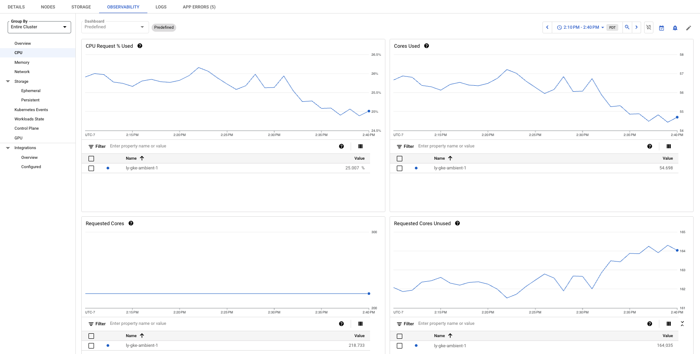

# LinkerD Performance Test Setup

## add linkerd helm repo
```bash
helm repo add linkerd https://helm.linkerd.io/stable
```

## install linkerd crds
```bash
helm install linkerd-crds linkerd/linkerd-crds -n linkerd --version 1.8.0 --create-namespace
```

## install linkerd-control-plane chart with default no reservation requests set
```bash
helm upgrade --install linkerd-control-plane -n linkerd \
  --version 1.16.11 \
  --set-file identityTrustAnchorsPEM=ca.crt \
  --set-file identity.issuer.tls.crtPEM=issuer.crt \
  --set-file identity.issuer.tls.keyPEM=issuer.key \
  --set proxy.cores=8 \
  linkerd/linkerd-control-plane
```

## install linkerd-control-plane chart with half istio proxy reservation requests
```bash
helm upgrade --install linkerd-control-plane -n linkerd \
  --version 1.16.11 \
  --set-file identityTrustAnchorsPEM=ca.crt \
  --set-file identity.issuer.tls.crtPEM=issuer.crt \
  --set-file identity.issuer.tls.keyPEM=issuer.key \
  --set proxy.cores=8 \
  --set proxy.resources.cpu.request=50m \
  --set proxy.resources.memory.request=128Mi \
  linkerd/linkerd-control-plane
```

## install linkerd-control-plane chart with default istio proxy reservation requests
```bash
helm upgrade --install linkerd-control-plane -n linkerd \
  --version 1.16.11 \
  --set-file identityTrustAnchorsPEM=ca.crt \
  --set-file identity.issuer.tls.crtPEM=issuer.crt \
  --set-file identity.issuer.tls.keyPEM=issuer.key \
  --set proxy.cores=8 \
  --set proxy.resources.cpu.request=100m \
  --set proxy.resources.memory.request=128Mi \
  linkerd/linkerd-control-plane
``` 

## install linkerd-control-plane chart with double istio proxy reservation requests
```bash
helm upgrade --install linkerd-control-plane -n linkerd \
  --version 1.16.11 \
  --set-file identityTrustAnchorsPEM=ca.crt \
  --set-file identity.issuer.tls.crtPEM=issuer.crt \
  --set-file identity.issuer.tls.keyPEM=issuer.key \
  --set proxy.cores=8 \
  --set proxy.resources.cpu.request=200m \
  --set proxy.resources.memory.request=256Mi \
  linkerd/linkerd-control-plane
```

## check
```bash
linkerd check
```

## install viz extension (optional)
```bash
linkerd viz install | kubectl apply -f -
```

## explore linkerd dashboard (optional)
```bash
linkerd viz dashboard &
```


# Configure an App

## deploy client into linkerd mesh
```bash
kubectl apply -k client/linkerd
```

## deploy httpbin
```bash
kubectl apply -k httpbin/linkerd
```

check to see if httpbin has been deployed with a linkerd proxy
```bash
kubectl get pods -n httpbin
```

## exec into sleep client and curl httpbin /get endpoint to verify mTLS
```bash
kubectl exec -it deploy/sleep -n client -c sleep sh

curl httpbin.httpbin.svc.cluster.local:8000/get
```

Output should look similar to below:
```
{
  "args": {}, 
  "headers": {
    "Accept": "*/*", 
    "Host": "httpbin.httpbin.svc.cluster.local:8000", 
    "L5D-Client-Id": "sleep.client.serviceaccount.identity.linkerd.cluster.local", 
    "User-Agent": "curl/8.6.0"
  }, 
  "origin": "10.42.0.22", 
  "url": "http://httpbin.httpbin.svc.cluster.local:8000/get"
}
```

The `L5D-Client-Id` header is added by the linkerd proxy when it establishes an mTLS connection

## remove httpbin
```bash
kubectl delete -k httpbin/linkerd
```


# Set up the Performance Test

## deploy 50 namespace tiered-app into linkerd mesh
```bash
kubectl apply -k tiered-app/50-namespace-app/linkerd
```

## exec into sleep client and curl tiered-app
```bash
kubectl exec -it deploy/sleep -n client sh

curl http://tier-1-app-a.ns-1.svc.cluster.local:8080
```

## deploy 50 vegeta loadgenerators
```bash
kubectl apply -k loadgenerators/50-loadgenerators
```

## watch logs of vegeta loadgenerator
```bash
kubectl logs -l app=vegeta -c vegeta -f -n ns-1
```

## watch top pods
```bash
watch kubectl top pods -n ns-1
watch kubectl top pods -n kube-system --sort-by cpu
```

## collect logs
In the `experiment-data/tail-logs.sh` script change the following variables
```
# Define the range of namespaces
start_namespace=1
end_namespace=50

# Define the output file
output_file="450rps-10m-50-app-linkerd-default-istio-resources-data-run-1.md"
```

Run the script to collect logs:
```
cd experiment-data
./tail-logs.sh
```

## example exec into vegeta to run your own test (optional)
```bash
kubectl --namespace ns-1 exec -it deploy/vegeta -c vegeta -- /bin/sh
```

test run:
```bash
echo "GET http://tier-1-app-a.ns-1.svc.cluster.local:8080" | vegeta attack -dns-ttl=0 -rate 500/1s -duration=2s | tee results.bin | vegeta report -type=text
```

## uninstall
helm uninstall linkerd-control-plane -n linkerd
helm uninstall linkerd-crds -n linkerd

## 50 namespace app notes
- 50 namespace isolated applications
- 3-tier application, 4 deployments per namespace, 1 replicas per deployment 
  - A > B1,B2 > C
  - CPU requests: 700m // CPU limits: 700m (guaranteed QoS)
  - MEM requests: 500Mi // MEM limits: 500Mi (guaranteed QoS)
- Application Latency expectations:
  - average latency < 40ms
  - max latency < 200ms
- Expected CPU utilization tuned to around 30-40% (visualized in GKE Observability)

Total application baseline requirements are 140 CPU cores and 100 GB memory

- Load generator per namespace targeting tier 1 application level
  - deployed to separate loadgen node pool
  - using n2-standard-8 spot instances in autoscaling mode 1-6 nodes
  - CPU requests: 500m // CPU limits: 500m (guaranteed QoS)
  - MEM requests: 300Mi // MEM limits: 300Mi (guaranteed QoS)
  - Sidecar per Load Generator adds 200m // 256 Mi per client

Total load generator baseline requirements are 30 CPU cores and 22 GB memory

- LinkerD Component Requests:
  - 200 sidecars (50 namespaces // 4 services each namespace) - `200m` CPU and `256Mi` memory
  - linkerd - `50m` and `128Mi` memory
  
Total LinkerD Components requirements are CPU: 40 CPU Cores  and 52GB memory

#### Total expected baseline (not including default GKE addons)
Total expected baseline requirements: 210 CPU Cores and 174GB memory

## Experiment outcome
- 12 application nodes (n2-standard-8)
- 3 loadgenerator nodes (n2-standard-8)
- Total CPU: 240 vCPU
- stable 200 RPS across 50 load generators x 4 services per namespace totaling 10K RPS
- Average latency in the 5-15ms, max latency under our target of <200ms
- Average latency in the 4-6ms, max latency of <110ms which is lower than our target of <200ms

- Number of Deployments using `k get deploy -A | wc -l`: 267
- Number of Pods using `k get pods -A | grep Running | wc -l`: 335
- Number of Services using `k get svc -A | wc -l`: 220
- Number of Containers `kubectl get pod --all-namespaces | awk '{print $3}' | awk -F/ '{s+=$1} END {print s}'`: 649

GKE Observability (30 min)
